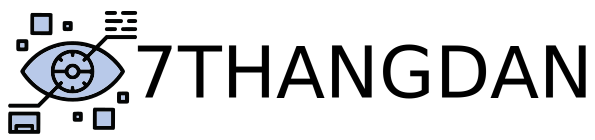
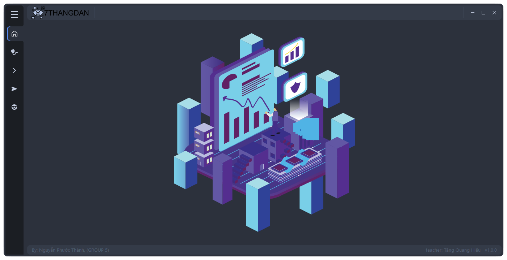

# 7THANGDAN

<div>
  <p align="center">
     
  </p>
</div>

This application is designed to simulate image transformations and allows users to perform various operations on rectangles drawn on a white background. The functions provided include creating a white background, drawing rectangles based on user input, and applying translation, rotation, and scaling transformations to the rectangles.

<p align="center">
  
  
  
  <a href="https://github.com/Zeres-Engel"></a>
</p>

# Table of Content
- [Overview](#overview)
- [Deploying the Product](#deploying-the-product)
    - [User Interface](#user-interface)
    - [Configuration](#configuration)

## Overview

The objective of this assignment is to familiarize students with geometric primitives and transformations through the development of a program. The program allows for the drawing of rectangles and the application of 2D transformations. Students will have the opportunity to explore concepts such as translation, rotation, and scaling, using the mouse to interact with the application.

  

## Deploying the Product

The application is designed to simulate image transformations and provides interactivity with rectangles on a white background. With this application, users can perform essential operations such as drawing rectangles and applying translation, rotation, and scaling transformations.

  ### User Interface

 Key features of the application include:

  * Creating a white background: The application initializes with a blank canvas and a white background, providing a clean space for subsequent operations.

  * Drawing rectangles: Users can interactively draw rectangles using the mouse. By clicking on a starting coordinate (p1(x1, y1)), dragging the mouse to a different position (p2(x2, y2)), and releasing the mouse, a rectangle corresponding to the selected coordinates will be drawn on the canvas.

     

  * Performing translation transformations: Users can apply translation transformations to rectangles. By inputting translation information, such as the amount to move in the x and y directions, the application calculates the new coordinates of the rectangle after the translation.

     

  * Applying rotation transformations: Users can choose the rotation transformation function to rotate rectangles. By specifying the rotation angle, the application calculates the new coordinates of the rectangle after the rotation.

     

  * Utilizing scaling transformations: The scaling transformation function enables users to apply scaling factors to rectangles. By inputting the scaling factors for the horizontal and vertical directions, a new rectangle will be drawn with adjusted coordinates based on the scaling transformation.

     

  ### Configuration

  To run the 7THANGDAN application, follow the steps below:

  1. Install Dependencies:
    Make sure you have the required dependencies installed in your environment. You can install them by running the following command:
      ```shell
      pip install -r requirements.txt
      ```

  2. Run the Application:
    Once the dependencies are installed, you can run the application using the following command:
      ```shell
      python main.py
      ```